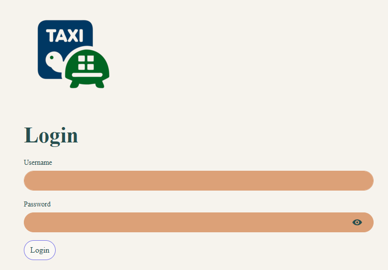
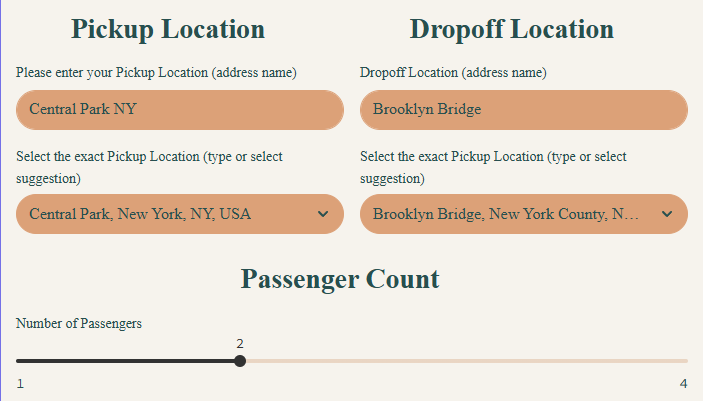
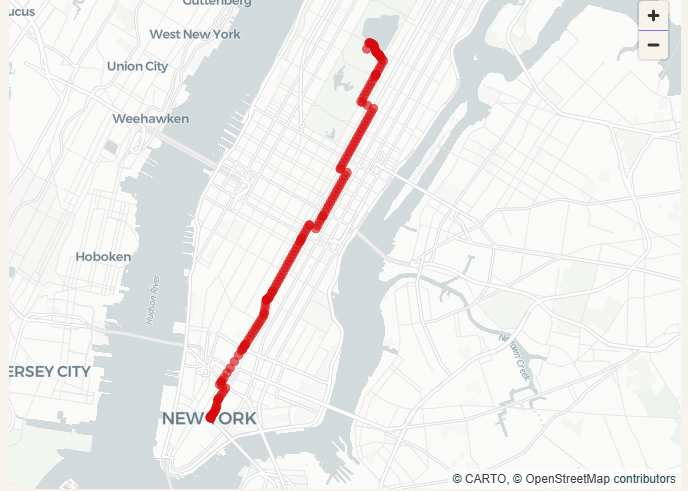

# NYC Taxi Fare & Trip Duration Predict

## Project Overview
This project focuses on developing a machine learning model to predict the cost and duration of taxi trips in New York City. By leveraging various factors influencing trip dynamics, the model aims to provide accurate estimations for both passengers and taxi operators.

## Collaborators
- Daniel Aldana
- Joaquin Cosentino
- Jorge Salsamendi
- Nahuel de la Cruz
- Luis Ángel Motta
- Matias Morgado
- Flavio Campos
- Christian Carrera

## Key Features and Functionalities

The project incorporates the following key features and functionalities:

*   **Trip Cost Prediction:** The core functionality involves predicting the cost of a taxi trip based on a combination of factors.
*   **Trip Duration Prediction:** In addition to cost prediction, the model also estimates the duration of a taxi trip, providing a comprehensive understanding of the trip's overall characteristics.
*   **Weather Condition Integration:** The model considers weather conditions such as cloudy, storm, snow, sunny, extreme heat, or extreme cold. This integration allows the model to adapt to weather-related impacts on traffic and demand.
*   **Traffic Analysis:** Real-time or historical traffic data is incorporated to capture the influence of traffic congestion on trip duration and cost.
*   **Demand Forecasting:** The model takes into account the fluctuations in demand for taxi services based on time of day, day of the week, and special events.
*   **Pick-up and Drop-off Location Analysis:** The origin and destination of the trip are considered as crucial factors, as different locations may have varying traffic patterns and demand levels.
*   **Distance Traveled:** The distance covered during the trip is a fundamental parameter used in both cost and duration predictions.
*   **Initial Fare (Flag Drop Cost):** The initial fare or flag drop cost is included as a base component of the overall trip cost.
*   **Passenger Count:** The number of passengers is factored in, as it can influence the type of vehicle required and potentially the trip duration.
*   **Daylight Cycle Consideration:** The model incorporates the time of day (daylight cycle) to capture the impact of different periods (e.g., rush hour, late night) on traffic and demand.

## Data Sources

The project utilizes a combination of data sources, including:

*   **Taxi trip data** (containing information on pick-up/drop-off locations, distance, duration, cost, and passenger count)
*   **Weather data** (historical and real-time weather conditions)
*   **Traffic data** (real-time traffic flow and congestion levels)
*   **Demand data** (historical demand patterns and event schedules)

## Machine Learning Model

The project employs a single XGBoost model with a dual-target configuration to predict both trip duration and cost simultaneously. This approach allows the model to learn the interdependencies between these two variables and potentially improve prediction accuracy. The XGBoost model is trained using the collected data to learn the relationships between the various factors and the trip cost and duration. The model is carefully evaluated and refined to ensure accurate and reliable predictions for both targets.

## Potential Applications

The project has several potential applications, including:

*   **Passenger Trip Planning:** Providing passengers with estimated costs and durations for their taxi trips, enabling them to make informed decisions.
*   **Taxi Operator Optimization:** Assisting taxi operators in optimizing their pricing strategies and resource allocation based on predicted demand and trip characteristics.
*   **Traffic Management:** Providing insights into traffic patterns and demand fluctuations, enabling traffic management authorities to make data-driven decisions.

## Requirements and Installation

This project utilizes Docker containers to ensure a consistent and reproducible environment for each component, including the UI, ML model, APIs like route tracing, geolocation search, weather services, and FastAPI.

### Prerequisites

Before you begin, ensure you have the following software installed:

1.  **WSL (Windows Subsystem for Linux)**: This is required if you are running on Windows. [Follow the official Microsoft documentation](https://learn.microsoft.com/en-us/windows/wsl/install) for installation instructions.
2.  **Docker Engine**: You can choose either:
    *   **Docker Desktop for Windows**: A user-friendly interface for managing Docker containers. [Download Docker Desktop](https://www.docker.com/products/docker-desktop/).
    *   **Docker Engine via Terminal (Linux)**: If you are using Linux, you can install Docker Engine directly through your terminal. Refer to the official Docker documentation for your specific distribution.

### Installation Steps

1.  **Clone the Repository**:

    ```bash
    git clone https://github.com/DanielAldanaBejarano/taxi-fare-duration-predict.git
    cd ./taxi-fare-duration-predict
    ```

2.  **Docker**:
    <br><br>
    The project uses Docker and Docker Compose to orchestrate the different containers. 
    <br><br>
    - **Step 1: Prerequisites**
        <br><br>
       Before you begin, ensure you have the following installed on your system:
       * **Docker Engine**
       * **Docker Compose**
        <br><br>
       For Windows and macOS, installing **Docker Desktop** is the easiest option as it includes both Docker and Docker Compose. For Linux, you may need to install them separately.
        <br><br>
    - **Step 2: Ensure the Docker Engine is Running**
        <br><br>
       Docker must be running on your machine before you can issue any commands.
        <br><br>
       - **On Windows (with Docker Desktop)**:
       1. Launch Docker Desktop from the Start Menu or desktop shortcut.
       2. Wait for the Docker icon in the system tray to become stable (it should stop animating).
       3. You can verify it's running by opening a terminal (like PowerShell or CMD) and running:
         ```bash
         docker --version
         ```
       This should output the installed Docker version without any connection errors.
        <br><br>
       - **On Linux (Command Line)**:
       1. Open a terminal.
       2. Check the status of the Docker service using `systemctl`:
         ```bash
         sudo systemctl status docker
         ```
       3. If the service is not active, start it with:
         ```bash
         sudo systemctl start docker
         ```
    <br><br>
    - **Step 3: Create the Shared Network**
    <br><br>
       Create a new Docker bridge network:
       ```bash
       docker network create shared-network
       ```
    <br><br>
    - **Step 4: Build and Run the Containers**
    <br><br>
       With Docker running and the network created, you can now launch the entire application stack.
    <br><br>
       1. Navigate to the root directory of the project in your terminal, where the `docker-compose.yml` file is located.
          ```bash
          cd ./taxi-fare-duration-predict
          ```
          <br><br>
       2. Run the following command to build the images (or rebuild if changes were made) and start the containers in the background.

          ```bash
          docker-compose up --build -d
          ```
        <br><br>
       Let's break down this command:
       *   `docker-compose up`: This is the main command to start the services defined in `docker-compose.yml`.
       *   `--build`: This flag forces Docker Compose to rebuild the service images from their respective Dockerfiles. It's useful when you have updated the source code or the Dockerfile itself.
       *   `-d`: This stands for "detached mode". It runs the containers in the background and returns control of your terminal. Without it, you would see a continuous stream of logs from all containers.
        <br><br>
    - **Step 5: Verification**
        <br><br>
       To verify that all containers are running correctly, you can use the following command:

       ```bash
       docker ps
       ```
        <br><br>
       This command will list all running containers, along with their status and exposed ports. Make sure all the services defined in your `docker-compose.yml` file are listed and have a status of "Up".
<br><br>
3.  **Automatic Dependency Installation**:
    Each service within the Docker containers has its own set of requirements (specified in a `requirements.txt`). When the `docker-compose up --build` command is executed, Docker automatically installs these dependencies for each container.
<br><br>
4.  **Accessing the Application**:
    Once all the containers are up and running, you can access the different components of the application through the appropriate ports. Check the `docker-compose.yml` file for the port mappings for each service.
<br><br>
    *   **UI**: Accessed through a web browser at `http://localhost:8501`
    *   **FastAPI backend**: Accessed through `http://localhost:5000`
<br>

## UI Usage

### Step 1: Login



To access and test the system, the user must first log in. Follow these steps:

1.  **Enter Username:** In the 'Username' field, type `admin@example.com`.
2.  **Enter Password:** In the 'Password' field, type `admin`.
3.  **Click Login:** Press the 'Login' button to proceed to the system.

If the user prefers, they can create their own user by selecting 'Create New User' in the left panel.

### Step 2: Enter Pickup and Dropoff Locations and Passenger Count



After logging in, the system will prompt the user to enter their pickup and dropoff locations.

1.  **Enter Pickup Location (Search):** In the 'Please enter your Pickup Location (address name)' field, type a search query for your desired pickup location (e.g., `Central Park NY`). The system will automatically search for matching geolocations.
2.  **Select Exact Pickup Location:** In the field immediately below (labeled 'Select the exact Pickup Location'), click on the dropdown list. From the options provided by the system, select the precise geolocation that matches your intended pickup destination (e.g., `Central Park, New York, NY, USA`).
3.  **Enter Dropoff Location (Search):** Similarly, in the 'Dropoff Location (address name)' field, type a search query for your desired dropoff location (e.g., `Brooklyn Bridge`). The system will search for matching geolocations.
4.  **Select Exact Dropoff Location:** In the field immediately below (labeled 'Select the exact Dropoff Location'), click on the dropdown list. From the options provided, select the precise geolocation that matches your intended dropoff destination (e.g., `Brooklyn Bridge, New York County, NY, USA`).
5.  **Set Passenger Count:** Locate the 'Number of Passengers' slider. Drag the slider to the desired number of passengers for the trip.

### Step 3: View Route and Calculate Fare

Once the pickup and dropoff locations are selected, the system will automatically display the most efficient route on the map.



To calculate the estimated fare and duration of the trip:

1.  **Click Calculate Fare and Distance Button:** Locate and click the button labeled `Calculate Fare and Distance` and then `Confirm the trip info to calculate`.
2.  **View Predicted Fare and Duration:** The system will then display the estimated fare and duration of the trip in a new field (e.g., `Predicted Fare: $26.39. Predicted Duration: 24.0 minutes.`).