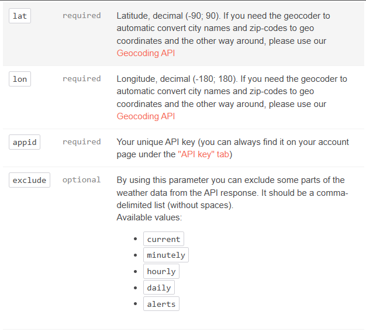

# Instructions to use OpenWeatherMap

API key:

b82fd8cdaf6bc8f8196168358826ff12

Endpoint:

api.openweathermap.org/data/2.5/weather

Example of API call:
api.openweathermap.org/data/2.5/weather?lat={lat}&lon={lon}&APPID={API_key}

Parameters:

Useful links:

- API documentation: https://openweathermap.org/api
- Weather codes: https://openweathermap.org/weather-conditions#Weather-Condition-Codes-2